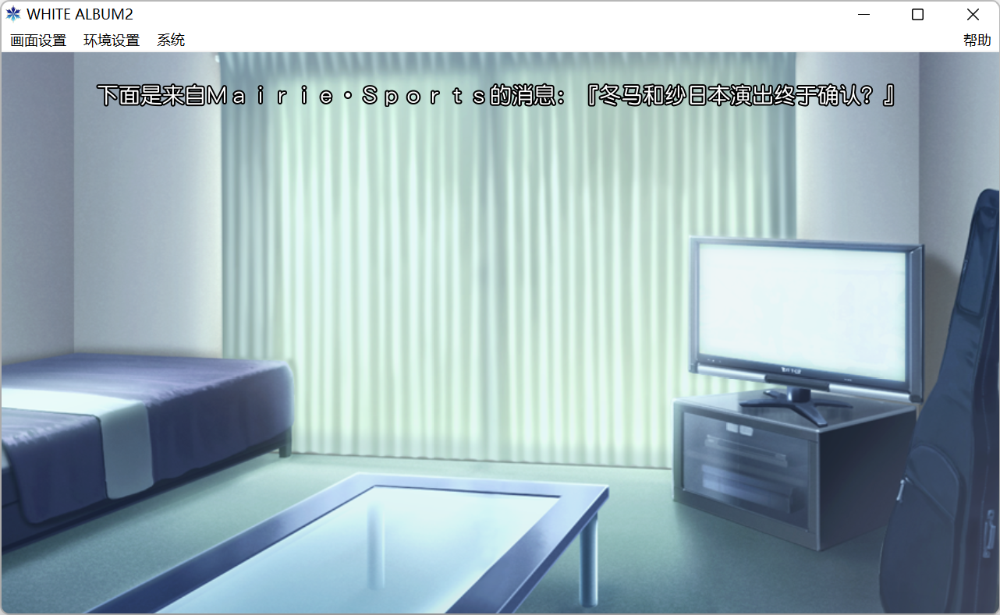

# WHITE ALBUM 2 中文字幕补丁

## 介绍 & 使用方法

为 WHITE ALBUM 2 仅语音部分添加字幕。

将补丁解包至游戏根目录，然后直接运行游戏主程序即可。

在游戏菜单 `帮助 | 系统信息` 中可查看当前补丁的版本。

## 许可

程序参考了 [TodokanaiTL/subtitles](https://github.com/TodokanaiTL/subtitles)。

文本翻译自 [TodokanaiTL/WA2EnglishPatch](https://github.com/TodokanaiTL/WA2EnglishPatch) 翻译的英文文本。

本项目基于 MIT 协议授权。

## 说明

### 程序

程序参考上文所述的项目进行了较大幅度的修改，添加了 Unicode 支持，修复了一些问题并优化了性能。编译程序需要安装 DirectX SDK June 2010。

字幕源文件为 YAML 格式，利用 `sub_compiler.py` 将其编译为程序接受的二进制字幕文件与字库。如果您希望自行编译字幕文本，请确保已安装 Python 包 `PyYAML`，并修改 `sub_compiler.py` 使其中的字体路径指向您希望使用的字体文件。您也可以修改字号、描边等其他参数，但需要修改程序源代码并重新编译，以匹配修改后的值。

### 游戏

程序利用音频编号确定何时播放字幕。游戏中的音频分为两种类型，`Sound Effect` 与 `Voice`。`Sound Effect` 由自身编号唯一确定，`Voice` 由场景编号与自身编号共同确定。`Voice` 的场景编号**不一定**等同于其实际播放的场景，当一个 `Voice` 被在多个场景中播放时，其场景编号始终不变。因此，字幕源文件分为 `soundEffect` 与 `voice` 两部分。`soundEffect` 部分只需指定 `id`，`voice` 部分需要指定 `scene` 与 `id`。

## 支持

欢迎提交程序 bug 与文本翻译问题。

