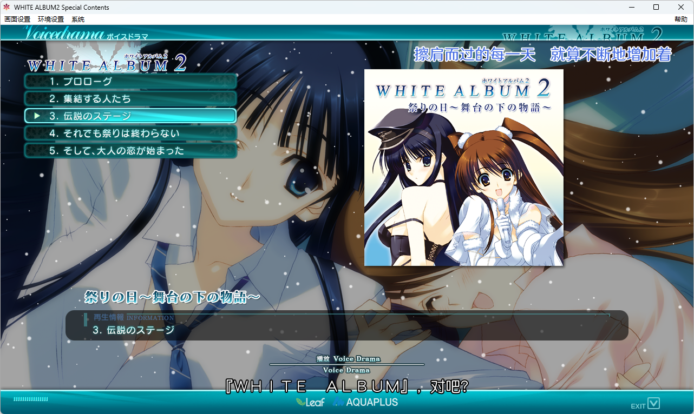

# WHITE ALBUM 2 Special Contents 中文字幕补丁

## 介绍 & 使用方法

为 WHITE ALBUM 2 Special Contents 的广播剧添加字幕。

含背景音乐的部分还会添加歌词。

暂未添加『2016 年的除夕』的『Talk Comment』章节的字幕。

将补丁解包至游戏根目录，然后直接运行游戏主程序即可。

在游戏菜单 `帮助 | 系统信息` 中可查看当前补丁的版本。

## 说明

广播剧大体上被视为 `BGM` 处理，并额外具有一个章节编号，即由广播剧编号及章节编号共同确定。为保证互不干扰，广播剧与背景音乐分为两个部分存储。因此，字幕源文件分为 `voiceDrama` 与 `song` 两部分，且均需指定 `id` 与 `chapter`。与本体补丁相似，使用 `sub_compiler.py` 将字幕源文件编译为二进制字幕文件与字库。
